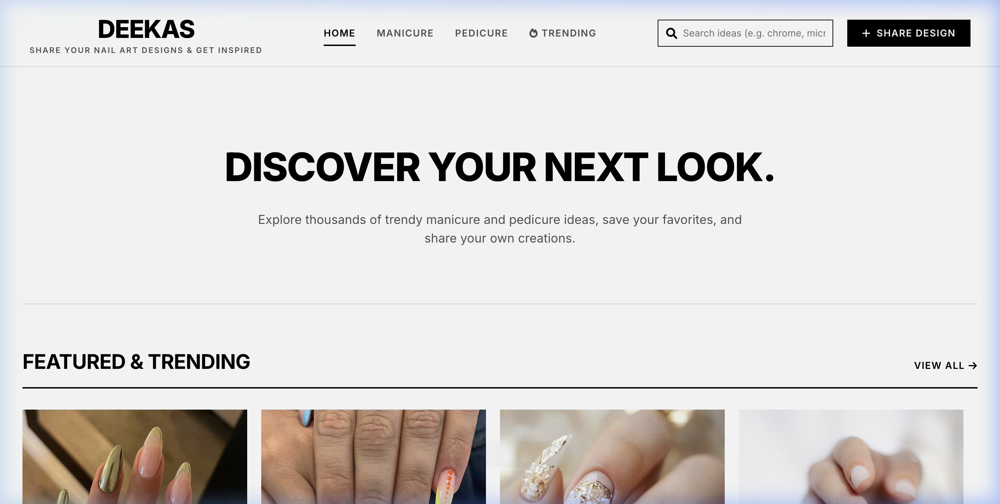
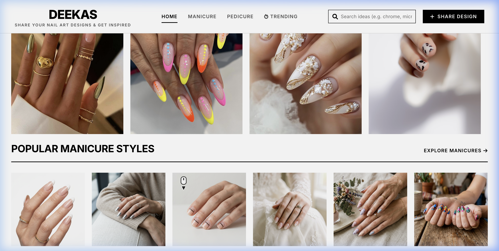
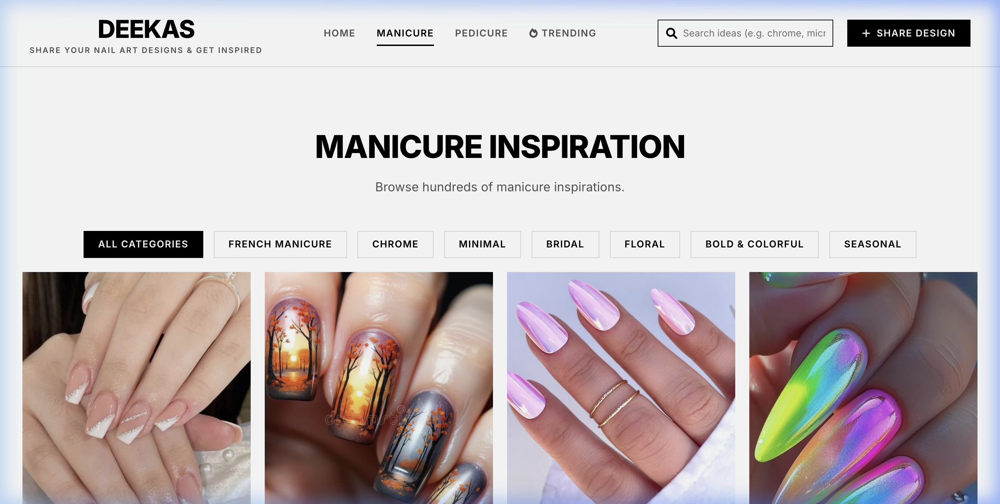

# Deekas - Premium Nail Art Gallery & Community



Deekas is a state-of-the-art, responsive web application designed for discovering, curating, and sharing high-end nail art. This project serves as a comprehensive technical showcase, featuring a custom image processing pipeline, algorithmic trending systems, and a polished, "Pinterest-inspired" user experience.

[**✨ View Live Demo**](https://shahhadiqa.github.io/ResumeWebsite/)

---

## 📸 Technical Showcase

### Intuitive Multi-Category Discovery

Users can browse curated galleries ranging from Minimalist to Bold Neon styles, with seamless categorical transitions and infinite-scrolling architecture.

### Dynamic Community Hub

A robust masonry-grid layout that intelligently manages high-resolution assets while maintaining high performance and smooth animations.

---

## 🛠️ Key Technical Features

### 1. Advanced Image Processing Engine
Built a custom Python backend (utilizing native macOS `sips` commands) to handle **Apple HEIC to JPG conversion**. This allows users to upload photos directly from their iPhones without browser-side compatibility issues.
- **Workflow**: Intercepts multi-part file uploads → Normalizes format via native CLI → Serves web-safe assets to the client.

### 2. Algorithmic "Trending 🔥" System
Implemented a dynamic curation engine that simulates social engagement. The "Trending" feed uses a custom weight-based algorithm to prioritize popular designs based on simulated user interactions, ensuring the home feed always feels fresh and alive.

### 3. Safari Lockdown Mode Compatibility
Developed a specialized **HTML5 Canvas conversion layer** specifically to bypass Safari's "Lockdown Mode" restrictions on file readers, ensuring 100% cross-browser compatibility for uploads.

### 4. Data Persistence & Performance
- **Local Persistence**: Integrated `localStorage` as a fast, zero-latency database for user interactions and custom uploads.
- **Lazy Loading**: Implemented optimized asset loading to ensure fast initial paint times despite a rich media library.

---

## 💻 Tech Stack

- **Frontend**: ES6+ JavaScript, CSS3 (Custom Grid/Flexbox), HTML5
- **Backend**: Python 3 (Custom HTTP Processor)
- **Tooling**: native macOS `sips` for Image Normalization, `heic2any` Fallback Engine
- **Storage Architecture**: Static JSON deployment merged with client-side persistence

---

## 📂 Project Architecture

```bash
├── index.html       # Single-Page App entry point
├── styles.css       # Premium design system & tokens
├── script.js        # Core App Logic & Gallery Engine
├── server.py        # HEIC Processing Pipeline
├── images/          # Structured Asset Repository
│   ├── manicure/    # Categorized mani-styles
│   └── pedicure/    # Categorized pedi-styles
└── screenshots/     # Showcase media for documentation
```

---

## 🚀 Future Roadmap
- [ ] **Cloud Migration**: Transitioning local storage to a Firebase/PostgreSQL cloud layer.
- [ ] **AI-Tagging**: Implementing auto-tagging for uploaded designs using Computer Vision.
- [ ] **Social Integration**: OAuth login and real-time community engagement features.